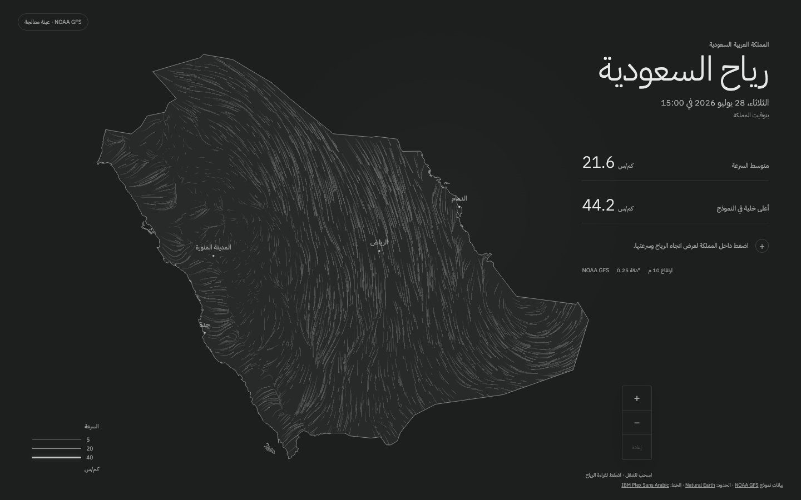
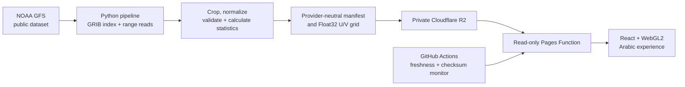

<div align="center">

# Saudi Wind · رياح السعودية

A beautiful, interactive visualization of wind across the Kingdom of Saudi
Arabia, with details about wind speed and direction.

[**Open the live experience**](https://saudi-wind.pages.dev) ·
[View the v1.0.0 release](https://github.com/Y3FAI/saudi-wind/releases/tag/v1.0.0) ·
[Read the engineering notes](docs/MILESTONE_5.md)

[](https://github.com/Y3FAI/saudi-wind/actions/workflows/ci.yml)
[](https://github.com/Y3FAI/saudi-wind/releases/latest)
[](LICENSE)

[](https://saudi-wind.pages.dev)

</div>

## What it does

Saudi Wind turns numerical weather-model data into an immediate, interactive
view of wind moving across the Kingdom. It is focused on one place, allowing
the map, controls, statistics, and city labels to be designed specifically for
Saudi Arabia.

- Animates thousands of continuous wind trails clipped precisely to the Saudi
  boundary.
- Lets people zoom, pan, and inspect wind speed and direction at any point
  inside the Kingdom.
- Shows the model timestamp in Arabia Standard Time, the national
  latitude-weighted average, and the highest model-grid speed.
- Supports touch, mouse, and keyboard interaction across desktop and mobile.
- Presents the complete experience in Arabic with a carefully designed RTL
  interface.
- Provides a static wind view for reduced-motion users and an explanatory
  fallback when WebGL2 is unavailable.
- Keeps the last verified grid available during upstream failures and clearly
  labels data older than 12 hours.

## Engineering highlights

This project covers the complete path from public scientific data to a
production user experience:

- **Custom visualization:** a WebGL2 trail renderer with CPU bilinear
  interpolation and particle advection, GPU fading and drawing, Saudi polygon
  clipping, adaptive particle density, and interaction-stable animation.
- **Weather-data pipeline:** a tested Python 3.12 processor discovers the
  newest complete NOAA cycle, reads GRIB indexes, range-downloads only 10 m U/V
  wind fields, crops them to Saudi Arabia, and validates the result.
- **Provider-neutral design:** the frontend consumes a versioned manifest and
  interleaved binary grid, allowing a future Saudi NCM adapter without changing
  the renderer.
- **Safe publication:** immutable grids are uploaded before the current
  manifest is changed. A failed run preserves the previous valid dataset.
- **Edge infrastructure:** Cloudflare Pages, Pages Functions, and a private R2
  bucket provide a small, read-only public API with cache rules appropriate to
  manifests and immutable binary grids.
- **Production quality:** RTL layout, Arabic typography, responsive design,
  keyboard controls, WCAG A/AA checks, reduced motion, security headers,
  monitoring, and cross-browser visual tests are included.

## Architecture



The browser performs bilinear interpolation directly over interleaved
little-endian Float32 `[u, v]` components. It converts metres per second to
km/h and derives meteorological direction at inspection time.

## Quality and performance

The v1 release was validated with:

| Area               | Result                                                         |
| ------------------ | -------------------------------------------------------------- |
| Rendering          | 60 FPS median on the measured desktop and mobile profiles      |
| Lighthouse         | 91 Performance, 100 Accessibility, 100 Best Practices, 100 SEO |
| TypeScript tests   | 19 unit and API tests                                          |
| Pipeline tests     | 18 processing and atomic-publication tests                     |
| Browser checks     | Chromium, Firefox, desktop WebKit, and mobile WebKit           |
| Accessibility      | Automated WCAG A/AA, keyboard, RTL, and reduced-motion checks  |
| Production monitor | Manifest freshness, grid length, and SHA-256 integrity         |

See the complete [Milestone 5 validation report](docs/MILESTONE_5.md) and
[release checklist](docs/RELEASE_CHECKLIST.md).

## Technology

| Layer           | Tools                                                           |
| --------------- | --------------------------------------------------------------- |
| Interface       | React 19, TypeScript, Vite, D3 Geo                              |
| Visualization   | Custom WebGL2 renderer, Canvas 2D base and reduced-motion frame |
| Data processing | Python 3.12, `uv`, GRIB byte-range processing                   |
| Infrastructure  | Cloudflare Pages, Pages Functions, private R2                   |
| Automation      | GitHub Actions, Bun, Wrangler                                   |
| Quality         | Vitest, Pytest, Playwright, axe-core, Lighthouse                |

## Run locally

Requirements:

- [Bun](https://bun.sh/) 1.3 or later
- [uv](https://docs.astral.sh/uv/) 0.11 or later

Install dependencies and start the application:

```sh
bun install
bun run dev
```

The development server uses the committed production-format fixture, so the
map works locally without Cloudflare credentials or a NOAA download.

Run the main quality suites:

```sh
bun run check
bun run check:pipeline
bun run test:ui
bun run test:performance
```

Rebuild the data artifact entirely offline:

```sh
uv sync --all-groups
uv run saudi-wind-pipeline fixture
```

Process the newest complete NOAA cycle into a separate review directory:

```sh
uv run saudi-wind-pipeline latest --output /tmp/saudi-wind-latest
```

Run the Pages Function and local R2 integration:

```sh
bun run build
bunx wrangler pages dev dist
```

Cloudflare configuration, publication credentials, rollback, and recovery are
documented in [Operations](docs/OPERATIONS.md).

## Data and scientific interpretation

The display uses the newest published NOAA GFS `f000` analysis available to
the application. NOAA GFS is numerical weather-model output—not a network of
live weather stations. The visible trails interpolate a 0.25° grid and should
not be interpreted as a measurement at every pixel.

The national mean includes only model-cell centres inside Saudi Arabia and
uses latitude weighting. The maximum is the highest included model-grid
speed, not a forecast of wind gusts.

See [Data methodology](docs/DATA.md) for the binary format, calculations,
validation rules, source provenance, and limitations.

## Product decisions

- Arabic-only and km/h-only for a focused first release.
- Wind at 10 m above ground from the latest model analysis.
- Trails and point inspection remain inside Saudi Arabia.
- No accounts, alerts, timeline, historical browser, or extra weather layers
  in v1.
- The data contract is ready for a future Saudi NCM provider.

The project was delivered through five approval-gated milestones covering
[visual direction](docs/MILESTONE_1.md),
[animation and interaction](docs/MILESTONE_2.md),
[NOAA processing](docs/MILESTONE_3.md),
[live Cloudflare delivery](docs/MILESTONE_4.md), and
[production hardening](docs/MILESTONE_5.md).

## Inspiration and attribution

The visual direction was inspired by Cameron Beccario's Tokyo Air work and
the clarity of [hint.fm/wind](http://hint.fm/wind/). Weather data comes from
NOAA GFS. The boundary is derived from Natural Earth, and the interface uses
IBM Plex Sans Arabic.

Detailed source and licensing attribution is available in [NOTICE.md](NOTICE.md).

## License

Project code is available under the [MIT License](LICENSE). Archived reference
projects are excluded from this repository and retain their original
licenses.
