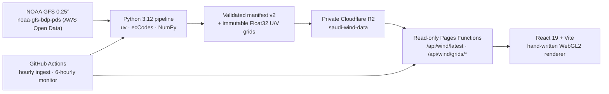

<div align="center">

# Saudi Wind · رياح السعودية

**An Arabic-first, interactive wind map for Saudi Arabia:** animated WebGL2
particle trails over a scrubbable five-day NOAA GFS forecast, with wind at 10 m
and 100 m above ground and 10 m gusts.

[**saudi-wind.pages.dev**](https://saudi-wind.pages.dev) ·
[Architecture](docs/ARCHITECTURE.md) ·
[Data methodology](docs/DATA.md) ·
[Operations](docs/OPERATIONS.md)

[](https://github.com/Y3FAI/saudi-wind/actions/workflows/ci.yml)
[](https://github.com/Y3FAI/saudi-wind/releases/latest)
[](LICENSE)

[](https://saudi-wind.pages.dev)

</div>

<!-- TODO: asset — the screenshot above is the v1.0.0 (Milestone 5) interface. Replace it with a capture of the current timeline + 10 m/100 m/gust UI once one can be produced from a real device. No current capture exists in the repository. -->

## What it is

Saudi Wind turns numerical weather-model output into an immediate, interactive
view of wind moving across the Kingdom of Saudi Arabia. It is deliberately
focused on one place, so the map, timeline, controls, statistics, and labels can
be designed specifically for Saudi Arabia.

The site is public and free to use, with no accounts, trackers, or stored user
data. It is an independent project: NOAA GFS data is public-domain model output,
not a network of Saudi weather stations.

## Features

- **Animated WebGL2 trails** — thousands of continuously advected particles,
  clipped exactly to the Saudi boundary.
- **Five-day forecast** — 41 frames in three-hour steps (`f000`–`f120`),
  scrubbed with a timeline slider or played back automatically.
- **Two wind heights** — wind at 10 m and 100 m above ground.
- **10 m gusts** — a gust layer at 10 m (magnitude from the GFS `GUST` record;
  direction derived from the 10 m wind).
- **Point inspection** — tap or click anywhere inside the Kingdom for speed and
  meteorological direction in Arabic.
- **National statistics** — latitude-weighted mean speed and the highest
  model-grid cell inside the boundary.
- **Arabia Standard Time** timestamps.
- **Arabic-first RTL interface**, km/h only, with touch, mouse, and keyboard
  interaction.
- **Graceful degradation** — a static frame for reduced-motion users, an Arabic
  fallback when WebGL2 is unavailable, and the last valid grid (clearly labelled
  once older than 12 hours) when upstream data fails.

## Architecture

Saudi Wind is a complete path from a public scientific dataset to a production
web experience. End-to-end detail, including the manifest contract, is in
[docs/ARCHITECTURE.md](docs/ARCHITECTURE.md) and [docs/DATA.md](docs/DATA.md).



| Layer      | What it does                                                                                                                                         | Where                             |
| ---------- | ---------------------------------------------------------------------------------------------------------------------------------------------------- | --------------------------------- |
| Ingestion  | Discovers the newest complete GFS cycle, range-downloads only the needed GRIB records, decodes, crops, validates, checksums, and builds the manifest | `pipeline/saudi_wind_pipeline/`   |
| Storage    | Private R2 bucket holding immutable `grids/*.bin` objects and the mutable `latest.json` manifest                                                     | Cloudflare R2 (`saudi-wind-data`) |
| API        | Read-only Cloudflare Pages Functions: the manifest, and grids addressed by a strict run-id/name pattern                                              | `functions/api/wind/`             |
| Rendering  | React 19 + Vite single page with a hand-written WebGL2 particle renderer and a device-tier budget                                                    | `src/`                            |
| Automation | CI plus hourly ingestion and a six-hourly production integrity monitor                                                                               | `.github/workflows/`              |

### Data flow

1. **Discover** the newest GFS cycle whose full five-day forecast is published.
2. **Fetch** the `.idx` index per step and range-download only the required
   records (10 m and 100 m `UGRD`/`VGRD`, surface `GUST`).
3. **Decode** with ecCodes, crop to 33°–57° E / 15°–33.5° N, and normalise to a
   north-to-south, west-to-east 0.25° scan.
4. **Validate** dimensions, finite values, plausible speeds, and serialization;
   compute Saudi-only statistics.
5. **Assemble** a schema-version-2 manifest: one frame per three-hour step, each
   frame referencing interleaved little-endian Float32 `[u, v]` grids in m/s.
6. **Publish** immutable grids first and `latest.json` last, so a failed run
   leaves the previous valid dataset untouched.
7. **Serve** the manifest and grids through read-only Pages Functions; the
   browser re-verifies byte length and SHA-256 before rendering.

## Data source and attribution

Forecast data is NOAA's **Global Forecast System (GFS)**, 0.25° `pgrb2.0p25`
products, read from the public [`noaa-gfs-bdp-pds`](https://registry.opendata.aws/noaa-gfs-bdp-pds/)
AWS Open Data bucket. GFS is produced by NOAA's National Centers for
Environmental Prediction (NCEP).

- GFS output is a **U.S. Government work in the public domain** and is not
  licensed or restricted. Saudi Wind redistributes derived grids, not the raw
  GRIB files.
- Attribution **does not imply** NOAA or NCEP endorsement of this project.
- GFS is **numerical model output**, not measured observation. The 0.25° grid,
  the 10 m/100 m heights, and the interpolated trails should not be read as a
  measurement at any specific point.

The Saudi boundary is derived from Natural Earth 1:10m Admin 0 data (public
domain), and the interface uses IBM Plex Sans Arabic (SIL OFL 1.1). Full
third-party notices are in [NOTICE.md](NOTICE.md).

## Local development

Requirements:

- [Bun](https://bun.sh/) 1.3 or later (package manager and test runner)
- [uv](https://docs.astral.sh/uv/) 0.11 or later (manages Python 3.12 and the
  pipeline dependencies)

```sh
bun install
bun run dev
```

In development the app reads the committed manifest at
`public/data/processed/latest.json`, so the map works without Cloudflare
credentials or a NOAA download.

Run the same gates CI runs:

```sh
bun run check            # prettier, TypeScript, Vitest, production build, Functions build
bun run check:pipeline   # ruff format/check + pytest
bun run test:ui          # Playwright UI, accessibility, compatibility, visual
bun run test:performance # Playwright frame-rate regression floor
```

Rebuild the processing artifact offline from the committed NOAA fixture:

```sh
uv sync --all-groups
uv run saudi-wind-pipeline fixture
```

Process the newest complete NOAA cycle into a separate review directory (a full
run makes roughly 250 HTTP byte-range requests across the 41 steps):

```sh
uv run saudi-wind-pipeline latest --output /tmp/saudi-wind-latest
```

Run the Pages Function against a local R2 binding:

```sh
bun run build
bunx wrangler pages dev dist
```

More detail: [CONTRIBUTING.md](CONTRIBUTING.md) and
[docs/OPERATIONS.md](docs/OPERATIONS.md).

## Deployment

The production site is a **Cloudflare Pages** project (`saudi-wind`) serving the
`dist` build, with a private R2 bucket (`saudi-wind-data`) bound as `WIND_DATA`
via `wrangler.jsonc`. The Pages Function layer is built from `functions/`.

Data publication is separate from the frontend deploy: the `Ingest NOAA wind`
GitHub Actions workflow runs hourly, processes the newest complete cycle, and
writes to R2 using repository Actions secrets. Those secrets, the publication
sequence, rollback, credential rotation, and the production monitor are
documented in [docs/OPERATIONS.md](docs/OPERATIONS.md).

The production URL is <https://saudi-wind.pages.dev>.

## Status

Saudi Wind is a working project rather than a finished product, and its history
includes a real gap worth stating plainly.

- **v1.0.0 — 28 July 2026.** The first release shipped a single NOAA GFS
  analysis (`gfs-20260728-12-f000`, step `f000`, 10 m only). The scheduled
  ingestion had no R2 credentials configured, so the deployed site served that
  one frozen July analysis for **44 days**. Stale data was labelled in the UI
  the whole time, and the monitor reported it.
- **10 September 2026.** Ingestion credentials were configured and a fresh
  production run (the `gfs-20260910-12` cycle) was published, replacing the
  frozen July analysis.
- **Forecast timeline.** The pipeline and frontend in this repository now build
  and render the five-day, three-hourly forecast described above — 41 frames,
  10 m and 100 m wind plus 10 m gusts, with timeline scrub, level toggle, gusts
  toggle, and playback.

### What is still missing

- **Rollout of the multi-frame contract.** The deployed API contract has
  historically been the single-frame `schemaVersion: 1` manifest. The schema-v2
  manifest and the timeline UI are implemented and tested in this repository;
  confirm which shape the deployed manifest is serving before assuming the full
  forecast is live (`bun run monitor:production` prints the run id, schema
  version, and frame count).
- **No history or archive.** Only the current five-day forecast window is
  browsable; older runs are not exposed.
- **One provider.** NOAA GFS only. The manifest and grid contract are
  provider-neutral, but no Saudi NCM adapter is implemented.
- **Arabic and km/h only.** No English interface and no unit switching.
- **No accounts or alerts.**
- **No committed real-hardware performance report.** The device budgets in
  `src/lib/deviceProfile.ts` are heuristics that headless CI cannot validate;
  see [docs/PERFORMANCE.md](docs/PERFORMANCE.md).

Historical, approval-gated milestone records are kept — clearly marked as
historical — in [docs/MILESTONE_1.md](docs/MILESTONE_1.md) through
[docs/MILESTONE_5.md](docs/MILESTONE_5.md); see the [docs index](docs/README.md).

## Technology

| Layer           | Tools                                                                 |
| --------------- | --------------------------------------------------------------------- |
| Interface       | React 19, TypeScript, Vite, D3 Geo                                    |
| Visualization   | Hand-written WebGL2 renderer; Canvas 2D base and reduced-motion frame |
| Data processing | Python 3.12, uv, ecCodes (GRIB2), NumPy, byte-range HTTP reads        |
| Infrastructure  | Cloudflare Pages, Pages Functions, private R2                         |
| Automation      | GitHub Actions, Bun, Wrangler                                         |
| Quality         | Vitest, Pytest, Ruff, Playwright, axe-core                            |

## Inspiration

The visual direction is inspired by Cameron Beccario's Tokyo Air work and the
clarity of [hint.fm/wind](http://hint.fm/wind/). Saudi Wind is an independent
project and is not affiliated with either.

## License

Project code is available under the [MIT License](LICENSE). Third-party
components (IBM Plex Sans Arabic, Natural Earth) and NOAA GFS data are covered
by their own terms in [NOTICE.md](NOTICE.md).
