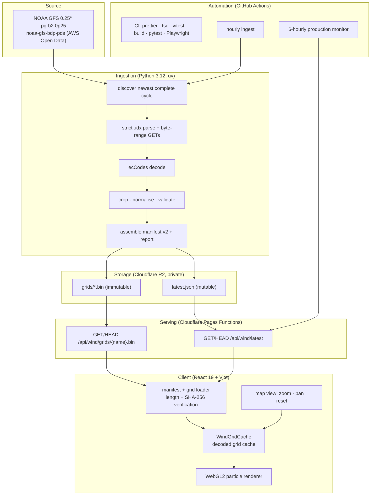

# Architecture

Saudi Wind is a small system with a long path: a public scientific dataset on
one end, an animated Arabic map on the other. This document describes the
layers, the files that implement them, and the data contracts between them.
For the numerical details of the grids, see [DATA.md](DATA.md).

## Layer map



## Layers

### 1. Ingestion — `pipeline/saudi_wind_pipeline/`

A Python 3.12 package (`saudi-wind-pipeline`, locked and run with `uv`).

| File            | Responsibility                                                                                                                                                       |
| --------------- | -------------------------------------------------------------------------------------------------------------------------------------------------------------------- |
| `core.py`       | GFS discovery, `.idx` parsing, byte-range selection, ecCodes decoding, crop/normalise/validate, statistics, grid serialization, manifest assembly, local publication |
| `r2_publish.py` | Cloudflare R2 publication: per-grid immutable upload, manifest-last replacement, verification read-back, optional old-run pruning                                    |
| `cli.py`        | `fixture`, `process`, `latest`, and `capture-fixture` commands                                                                                                       |

Key behaviours:

- **Discovery** looks back over up to 12 cycles (6-hourly) and accepts the newest
  cycle for which _every_ required record exists at _every_ forecast step. A
  run is identified by its cycle: `gfs-YYYYMMDD-HH`.
- **Byte-range reads** fetch only the GRIB records that are needed. Only the
  range for each selected record is downloaded, never the full model file.
- **Validation** rejects non-finite values, mismatched dimensions, inconsistent
  grid spacing, implausible speeds (> 150 m/s), and serialization drift. A
  representative set of cells (Riyadh, Jeddah, Dammam) is compared against the
  serialized bytes.
- **Publication order** is grids first, manifest last; an interrupted run leaves
  the previous manifest current. Immutable grids are never overwritten — a hash
  collision is an error, not a silent replace.

A single run produces **41 frames × 1 grid field = 41 grid objects**
(58,200 bytes each ≈ 2.3 MiB per run) plus one manifest (21,758 bytes) and one
validation report (52,219 bytes) — measured with
`pipeline/saudi_wind_pipeline/` replayed over the committed fixture for all 41
steps.

### 2. Storage — Cloudflare R2

Private bucket `saudi-wind-data`, bound to the Pages project as `WIND_DATA`
(`wrangler.jsonc`). Keys:

| Key                                       | Mutability | Content                                   |
| ----------------------------------------- | ---------- | ----------------------------------------- |
| `grids/gfs-YYYYMMDD-HH-fNNN-wind-10m.bin` | immutable  | one frame's 10 m wind, Float32 LE `[u,v]` |
| `latest.json`                             | mutable    | the current manifest                      |

Runs published before 11 September 2026 also wrote
`grids/gfs-YYYYMMDD-HH-fNNN-wind-100m.bin` and
`grids/gfs-YYYYMMDD-HH-fNNN-gust-10m.bin`. The narrowed pipeline writes only the
single `wind-10m` grid per frame and never reads the legacy names, and the
manifest it is serving now (run `gfs-20260911-00`) references only `wind-10m`.
The Pages Function's grid-name pattern and the production monitor's allowed-key
list still accept the legacy variable/level names, so any pre-narrowing manifest
kept inside the retention window keeps resolving. See
[OPERATIONS.md](OPERATIONS.md#grids-from-earlier-pipelines).

`r2.dev` is not enabled; all public traffic passes through the Pages Function.
Lifecycle and retention are in [OPERATIONS.md](OPERATIONS.md).

### 3. Serving — `functions/`

Cloudflare Pages Functions expose exactly two read-only endpoints:

| Route                        | Handler                               | Behaviour                                                                             |
| ---------------------------- | ------------------------------------- | ------------------------------------------------------------------------------------- |
| `/api/wind/latest`           | `functions/api/wind/latest.ts`        | Returns `latest.json` with `no-cache`; supports `HEAD` and `If-None-Match` (304)      |
| `/api/wind/grids/{name}.bin` | `functions/api/wind/grids/[runId].ts` | Validates the requested name against a strict pattern, then maps it to `grids/{name}` |

Shared rules in `functions/_shared/responses.ts`:

- only `GET` and `HEAD` are accepted (anything else is `405` with
  `Allow: GET, HEAD`);
- grid names must match `gfs-YYYYMMDD-HH-fNNN-wind-10m.bin` — the only name the
  pipeline publishes. For compatibility the accepted pattern is looser: the
  `-(wind|gust)-<level>m` suffix is optional (version-one runs carry no suffix)
  and any `wind`/`gust` level form resolves, so pre-narrowing runs keep working;
- no bucket listing, no writes, and no arbitrary object paths;
- failures return Arabic JSON with a `404` or `503` and are logged as structured
  events.

### 4. Client — `src/`

React 19 + Vite. No charting or rendering library — the particle renderer is
hand-written.

| File                                                          | Responsibility                                                                                               |
| ------------------------------------------------------------- | ------------------------------------------------------------------------------------------------------------ |
| `src/App.tsx`                                                 | Loads the boundary + manifest, owns frame/grid selection and the 15-minute revalidation loop                 |
| `src/lib/wind.ts`                                             | Manifest parser (`schemaVersion` 1 and 2), frame selection, grid download + SHA-256 verification, speed math |
| `src/lib/windGridCache.ts`                                    | Caches decoded `Float32Array` grids by URL and de-duplicates concurrent loads                                |
| `src/lib/webglWindRenderer.ts`                                | WebGL2 advection, fading trails, stencil clipping to the Saudi polygon                                       |
| `src/lib/map.ts`, `src/lib/format.ts`, `src/lib/windStyle.ts` | Map projection, formatting, and the visual style presets                                                     |
| `src/components/WindMap.tsx`                                  | Canvas host plus pointer/keyboard interaction (zoom, pan, reset)                                             |

The renderer only reads `vectors` and `manifest.grid`, so swapping grids never
involves the renderer. A frame that does not carry the selected grid key degrades
to the nearest frame that does rather than rendering nothing.

### 5. Automation — `.github/workflows/`

| Workflow                 | Trigger                      | Purpose                                                                          |
| ------------------------ | ---------------------------- | -------------------------------------------------------------------------------- |
| `ci.yml`                 | pull request, push to `main` | Format, TypeScript, Vitest, builds, pipeline tests, Playwright suites            |
| `ingest-wind.yml`        | hourly + manual dispatch     | Discover and publish the newest complete cycle; skips safely without credentials |
| `monitor-production.yml` | every six hours + manual     | Validate the deployed manifest, frames, freshness, and grid checksums            |

## Contracts

### Manifest (`latest.json`)

Two schema versions are supported. The client normalises both into one shape: a
list of frames.

**`schemaVersion: 2`** (current pipeline output):

```jsonc
{
  "schemaVersion": 2,
  "runId": "gfs-YYYYMMDD-HH",          // cycle identifies the run
  "provider": "NOAA_GFS",
  "modelRun": "…Z",
  "validTime": "…Z",                    // mirrors frames[0]
  "publishedAt": "…Z",
  "heightMeters": 10,
  "sourceUnits": "m/s",
  "displayUnits": "km/h",
  "sample": false,
  "grid": { "west": 33, "east": 57, "south": 15, "north": 33.5,
            "width": 97, "height": 75, "dx": 0.25, "dy": 0.25,
            "scan": "north-to-south-west-to-east" },
  "levels": [10],
  "variables": ["wind"],
  "frames": [
    {
      "step": 0,
      "validTime": "…Z",                // must equal modelRun + step hours
      "grids": {
        "wind-10m":  { "url": "/api/wind/grids/gfs-…-f000-wind-10m.bin",
                       "encoding": "float32-le-uv-interleaved",
                       "byteLength": 58200, "sha256": "…" }
      },
      "statistics": {
        "wind-10m": { "areaWeightedMeanKmh": 0, "maximumGridCellKmh": 0 }
      }
    }
    // … one frame per 3-hour step, f000 … f120
  ],
  "data": { … },                        // mirrors frames[0].grids["wind-10m"]
  "statistics": { … }                   // mirrors frames[0].statistics["wind-10m"]
}
```

**`schemaVersion: 1`** (legacy): a single analysis grid with `heightMeters: 10`
and top-level `data`/`statistics`. The client wraps it into one frame at step 0.
The `data`, `statistics`, and `validTime` mirrors exist so a v1-era client can
still read a v2 manifest's first frame.

`levels` and `variables` are **frozen constants for the published contract**
(`[10]` and `["wind"]`), not per-run derivations: a run publishes exactly one
field, and the pipeline refuses a frame that does not carry it.

Rejection rules the parser enforces: unsupported schema/provider/units/scan
order, non-ISO timestamps, non-increasing frame steps, `validTime` not equal to
`modelRun + step`, missing or duplicated grid keys, unknown grid keys, wrong
byte length or non-hex checksum, and statistics whose maximum is below the mean.

### Binary grid

Every grid object is `width × height × 2` little-endian Float32 values:
interleaved `u`, `v` components in metres per second, scanned north-to-south and
west-to-east. For the Saudi crop that is 97 × 75 × 2 × 4 = **58,200 bytes**.
Consumers verify byte length and SHA-256 before use. See [DATA.md](DATA.md).

## Design decisions

- **Provider-neutral contract.** The manifest names its provider and the binary
  encoding is not GFS-specific, so a future Saudi NCM adapter can emit the same
  shape without touching the renderer. Only `NOAA_GFS` is implemented today.
- **No renderer changes for new data.** Everything the renderer needs is
  `vectors` + `grid`; frames are a client-side concern.
- **Data is immutable, pointers are mutable.** Grids are content-addressed by
  run/step/field and never rewritten; only `latest.json` moves.
- **Fail safe, not fresh.** A failed run or unreachable bucket keeps the last
  valid grid on screen, visibly marked stale after 12 hours.
