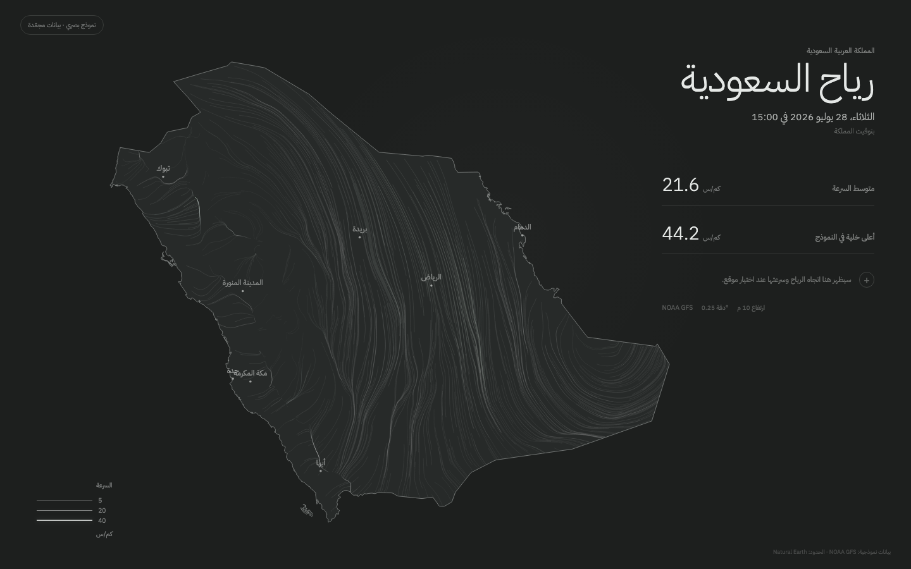
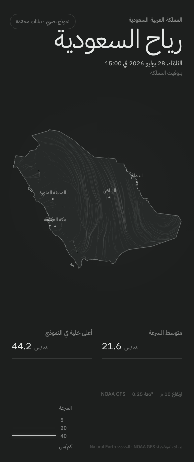

# Milestone 1 — Foundation and visual direction

## Delivered

- React, Vite, TypeScript, and Bun foundation.
- Arabic-only responsive layout and locally bundled IBM Plex Sans Arabic.
- Natural Earth 1:10m Saudi boundary.
- Frozen NOAA GFS 0.25° analysis at 10 m.
- Static monochrome trails clipped to Saudi Arabia.
- Major-city labels, timestamp, mean, maximum, source context, and km/h
  legend.
- MIT license, contributor guide, methodology, project plan, unit tests, CI,
  and Cloudflare configuration.

## Validation

Run:

```sh
bun run check
```

This verifies formatting, strict TypeScript, six unit tests, and a production
build.

## Review images

### Desktop



### Mobile



## Known limitations

- The fixture is frozen and the display is not live.
- Trails are static; animation begins only after visual approval.
- Location selection, zoom, and pan are intentionally absent.
- City-label collision handling is provisional.
- The statistic values describe coarse model-grid cells, not observations.

## Approval checklist

- Saudi silhouette and scale.
- Charcoal and monochrome palette.
- Arabic typography and information hierarchy.
- City-label selection and density.
- Desktop and mobile composition.
