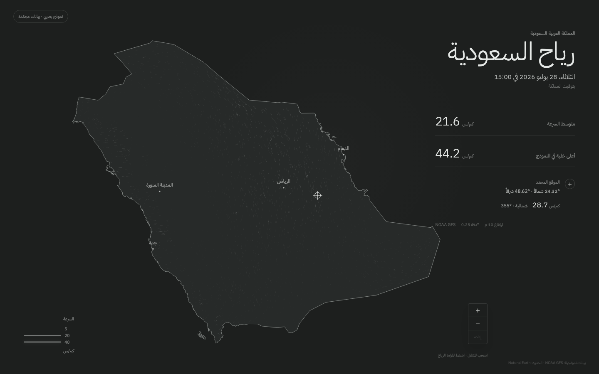
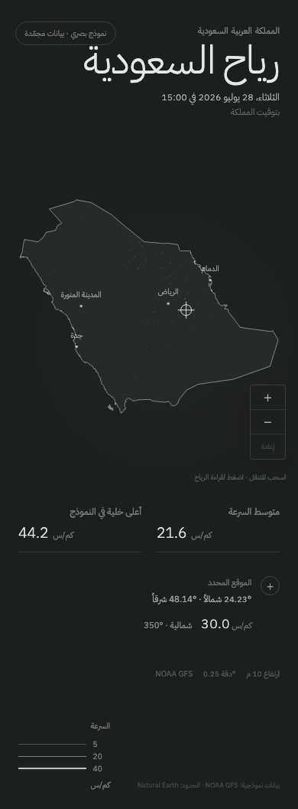

# Milestone 2 — Animation and interaction

## Delivered

- CPU particle advection using bilinear interpolation over the frozen U/V
  grid.
- WebGL2 triangle-segment rendering with persistent fading trails.
- Stencil clipping generated from the complete Saudi multipolygon, including
  islands.
- Adaptive particle counts for desktop and mobile.
- Pointer, touch, wheel, and pinch interaction.
- Constrained zoom and pan with an exact reset to the approved initial frame.
- Inside-Saudi inspection with coordinates, speed, meteorological direction,
  and a full Arabic compass label.
- Collision-aware city labels; secondary labels appear after zooming in.
- Static wind rendering when reduced motion is requested.
- An explanatory Arabic fallback when WebGL2 is unavailable.
- Automated desktop and mobile browser tests.

## Validation

Run:

```sh
bun run check
bun run test:ui
```

The current suite verifies twelve calculation/view tests and twelve browser
scenarios across desktop and mobile Chromium. Browser coverage includes the
initial Saudi frame, visible frame advancement, zoom/reset, inside/outside
inspection, reduced motion, and WebGL2 failure.

A two-second headless Chromium probe rendered approximately 60 frames per
second at both the 1440 × 900 desktop viewport and the emulated mobile
viewport. This is a development benchmark, not a substitute for the physical
device matrix planned for Milestone 5.

## Review images

### Desktop



### Mobile



## Known limitations

- Wind still comes from the frozen Milestone 1 NOAA fixture; live ingestion
  begins after Milestone 3 processing is approved.
- Particle motion is intentionally accelerated for visual legibility and is
  not a literal travel-time simulation.
- Firefox, Safari, iOS Safari, and physical-device performance validation are
  reserved for Milestone 5.
- The WebGL trail buffer currently uses a retained default framebuffer.
  Milestone 5 may replace it with texture ping-pong if device testing shows a
  material performance benefit.
- Secondary city labels use the approved eight-city set; adding more labels is
  outside version 1 unless requested.

## Approval checklist

- Animation character and perceived smoothness.
- Trail brightness, density, length, and speed.
- Zoom and pan constraints.
- Reset behavior.
- Point readout and Arabic direction wording.
- City-label visibility.
- Desktop and mobile responsiveness.
