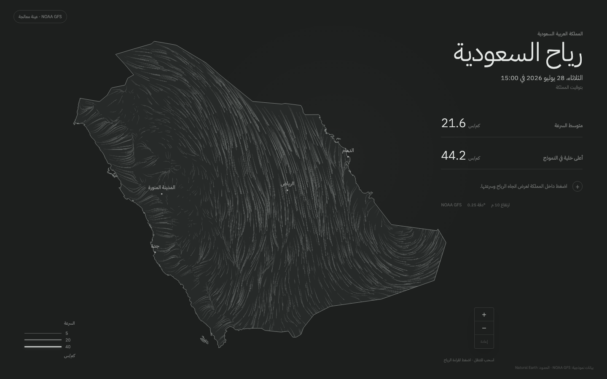
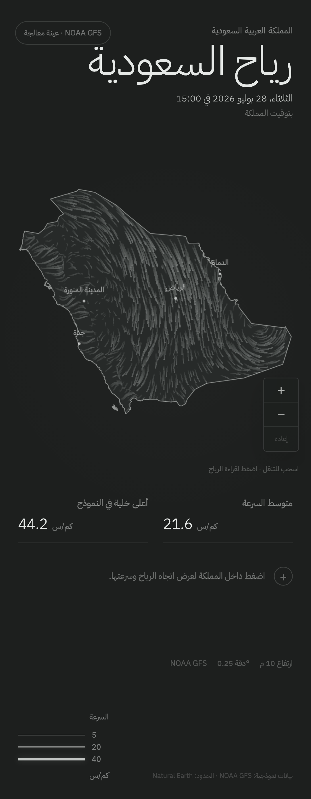

# Milestone 3 — NOAA processing pipeline

## Delivered

- Python 3.12 project managed and locked with `uv`.
- Discovery of the newest complete GFS cycle across the 6-hour NOAA schedule.
- Strict `.idx` parsing and independent HTTP range downloads for only
  `UGRD:10 m above ground` and `VGRD:10 m above ground`.
- ecCodes decoding, buffered Saudi crop, and explicit normalization to
  north-to-south / west-to-east scan order.
- Finite-value, dimension, spacing, timestamp, plausible-speed, byte-length,
  and SHA-256 validation.
- Saudi polygon masking with latitude-weighted mean and maximum grid-cell
  statistics.
- Immutable grid and per-run validation report, with `latest.json` published
  last to preserve the previous valid run on failure.
- A committed two-record NOAA source fixture and a network-free deterministic
  build command.
- Browser loading of the generated production-format artifact with manifest,
  byte-length, and checksum verification.
- Python pipeline checks added to pull-request CI.

## Source provenance

- Provider: NOAA Global Forecast System
- Dataset: `noaa-gfs-bdp-pds` public AWS bucket
- Model cycle and validity: 28 July 2026, 12:00 UTC (`f000`)
- Wind height: 10 m above ground
- Source grid: 0.25°
- Source URL:
  `https://noaa-gfs-bdp-pds.s3.amazonaws.com/gfs.20260728/12/atmos/gfs.t12z.pgrb2.0p25.f000`
- Download: two exact ranges totalling 1,934,382 bytes
- Download SHA-256:
  `2e97649ad7c6169a5bc9342b8c9f3a8fcb62c7533b946375ecf440dc370c1e08`

The full machine-readable report is committed at
`public/data/processed/reports/gfs-20260728-12-f000.validation.json`.

## Numerical validation

| Check                            | Result                                                             |
| -------------------------------- | ------------------------------------------------------------------ |
| Browser grid                     | 97 × 75, 0.25°, 58,200 bytes                                       |
| Scan order                       | North-to-south, west-to-east                                       |
| Finite U/V values                | Passed                                                             |
| Maximum buffered-crop speed      | 18.3259 m/s (below the 150 m/s rejection threshold)                |
| Cell centres inside Saudi Arabia | 2,742                                                              |
| Area-weighted Saudi mean         | 21.6 km/h                                                          |
| Maximum Saudi grid cell          | 44.2 km/h                                                          |
| Grid SHA-256                     | `7f333b2bf2749fbd16a28a184e140e0035ebc451ccc88838f5e6838a62e6cc78` |
| Rebuild against reviewed grid    | Byte-for-byte match                                                |
| Riyadh/Jeddah/Dammam grid cells  | Exact decoded U/V match after serialization                        |

The three explicit comparison cells produced 30.5 km/h at 46.75° E,
24.75° N; 28.0 km/h at 39.25° E, 21.50° N; and 30.2 km/h at 50.00° E,
26.50° N. Their decoded Float32 U/V pairs match the published binary exactly.

## Validation commands

```sh
uv sync --all-groups --frozen
bun run check:pipeline
uv run saudi-wind-pipeline fixture
bun run check
bun run test:ui
```

The current suites contain 14 Python pipeline tests, 14 TypeScript tests, and
14 desktop/mobile browser scenarios. A live discovery probe on 28 July 2026
correctly skipped the not-yet-complete 18 UTC candidate and selected the
complete 12 UTC analysis.

## Review images

### Desktop



### Mobile



## Known limitations

- The review deployment intentionally uses the committed processing fixture,
  so its timestamp remains frozen and is labelled as a processed sample.
- Hourly scheduling, R2 upload, retention, stale-data handling, and recovery
  from a missing live dataset belong to Milestone 4.
- GFS is model analysis, not a network of live Saudi wind sensors.
- The provider contract currently accepts NOAA GFS metadata only. The binary
  grid contract is provider-neutral; the frontend provider enum will expand
  when an NCM adapter is implemented.

## Approval checklist

- NOAA source provenance and exact range selection.
- Model-run and validity timestamp.
- Validation report and checksum.
- Saudi-only calculation methodology.
- Displayed 21.6 km/h mean and 44.2 km/h maximum.
- Deterministic offline reproduction.
