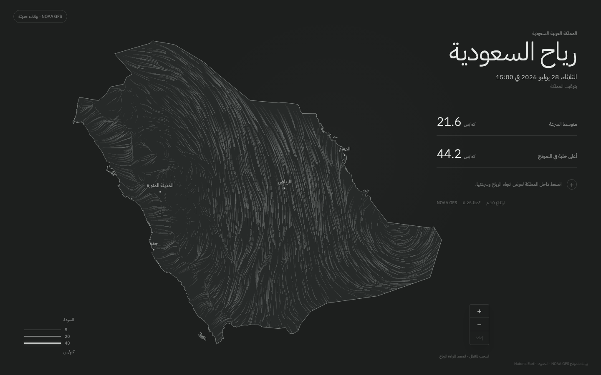
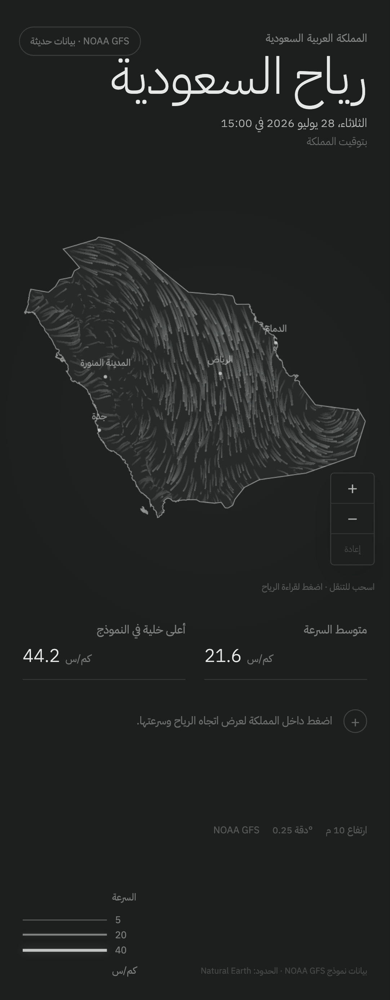

# Milestone 4 — Live Cloudflare delivery

## Delivered

- Private `saudi-wind-data` R2 Standard bucket.
- Thirty-day expiration for immutable `grids/` objects while preserving
  `latest.json`.
- Typed R2 binding generated from `wrangler.jsonc`.
- Read-only Pages Function endpoints for the manifest and strict run-ID grid
  paths.
- Explicit GET/HEAD-only policy, conditional ETag responses, secure response
  headers, and structured R2 failure logs.
- Hourly and manually dispatched GitHub Actions ingestion with non-overlapping
  execution.
- R2 publisher that rejects invalid paths, checksum mismatches, immutable
  collisions, duplicate runs, and rollback candidates.
- Atomic grid-first / manifest-last publication.
- Frontend loading from the live API with 15-minute revalidation.
- Twelve-hour stale indication while retaining the last valid grid.
- Arabic initial-unavailable state.
- Local-development fixture fallback without weakening production behavior.

## Live data

The seeded live manifest was processed directly from NOAA after Milestone 4
implementation. The preview reads it through the same Pages Function and
private R2 binding used by production.

- Preview: <https://agent-milestone-4-live-cloud.saudi-wind.pages.dev>
- Model run and validity: `2026-07-28T12:00:00Z`
- Published to R2: `2026-07-28T20:20:01.577186Z`
- Run ID: `gfs-20260728-12-f000`
- Grid: 58,200 bytes
- SHA-256:
  `7f333b2bf2749fbd16a28a184e140e0035ebc451ccc88838f5e6838a62e6cc78`
- Saudi area-weighted mean: 21.6 km/h
- Highest Saudi model-grid cell: 44.2 km/h

## Validation

```sh
bun run check
bun run check:pipeline
bun run test:ui
```

- 18 TypeScript tests, including four read-only API tests.
- 18 Python pipeline tests, including four R2 atomic-publication tests.
- 18 desktop/mobile browser scenarios, including stale and unavailable data.
- Pages Function bundle compilation.
- Generated binding types checked against `wrangler.jsonc`.
- Public edge GET and HEAD responses validated.
- Manifest conditional request returned HTTP 304.
- Invalid grid path returned HTTP 404.
- POST returned HTTP 405 with `Allow: GET, HEAD`.
- Downloaded grid length and SHA-256 matched the manifest.

## Review images

### Desktop



### Mobile



## Known limitations

- Scheduled ingestion requires the three repository Actions secrets documented
  in `OPERATIONS.md`.
- The UI shows only the newest valid analysis; history remains private rollback
  data and is not browsable.
- GitHub’s scheduled workflow timing is best-effort and may start later than
  the exact minute specified.
- GFS remains model analysis rather than live sensor observation.

## Approval checklist

- Real NOAA timestamp and values.
- Private R2 and read-only API behavior.
- Manifest/grid caching and checksums.
- Stale and never-loaded Arabic states.
- Failure recovery and previous-run preservation.
- Hourly automation and 30-day retention.
