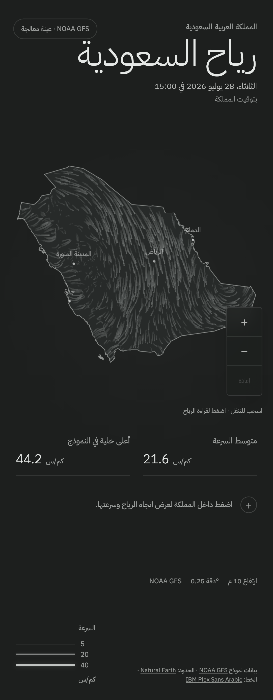

# Milestone 5 — Production hardening and release

## Delivered

- Reused WebGL buffers and cached shader locations to remove avoidable
  per-frame allocation and lookup work.
- Exposed one-second renderer FPS and particle-count samples for deterministic
  performance verification.
- Added keyboard pan, zoom, reset, and centre-point inspection with visible
  focus and Arabic instructions.
- Raised low-contrast informational text while retaining the monochrome
  hierarchy.
- Increased map control targets to at least 44 CSS pixels.
- Reduced the critical font CSS by importing only Arabic and Latin subsets.
- Added a restrictive Content Security Policy, HSTS, permissions policy,
  asset caching, and other response hardening.
- Added automated WCAG A/AA scanning and desktop/mobile Arabic visual
  baselines.
- Added Chromium desktop/mobile, Firefox, desktop WebKit, and mobile WebKit
  browser profiles.
- Added a six-hour production freshness and checksum monitor.
- Added infrastructure quota review, operations guidance, and the v1 release
  checklist.

## Validation

- Stable preview:
  <https://agent-milestone-5-production.saudi-wind.pages.dev>
- Audited deployment: <https://360c448b.saudi-wind.pages.dev>
- Browser engines: Chromium 151.0.7922.34, Firefox 153.0, and WebKit 26.5.
- 19 TypeScript unit and API tests.
- 18 Python processing and R2 publication tests.
- 34 UI, accessibility, compatibility, and visual checks.
- Two serial frame-rate checks: desktop 60 FPS median and mobile 60 FPS
  median.
- GitHub's shared software-rendered VM enforces a 50 FPS desktop regression
  floor and a 30 FPS mobile floor; release acceptance uses the representative
  local measurements above.
- Lighthouse mobile simulation: Performance 91, Accessibility 100, Best
  Practices 100; FCP 1.8 s, LCP 2.9 s, TBT 190 ms, CLS 0.002.
- Lighthouse desktop: Performance 100, Accessibility 100, Best Practices 100;
  FCP 0.5 s, LCP 0.7 s, TBT 0 ms, CLS 0.003.
- Public edge verified `no-cache` HTML, immutable hashed assets, CSP, HSTS,
  permissions policy, referrer policy, and MIME sniffing protection.
- Production health check passed with the live manifest and exact grid
  checksum.

The preview's SEO score is intentionally excluded because Cloudflare adds
`X-Robots-Tag: noindex` to preview deployments. Production includes a valid
`robots.txt` and is not assigned that preview-only header.

## Review images

### Desktop

### Mobile

## Browser interpretation

Playwright Chromium represents current Chrome and Android Chrome behavior.
Playwright WebKit represents the Safari rendering engine on desktop and an
iPhone viewport. Playwright Firefox covers the current Firefox engine. These
automated profiles do not replace testing on every physical GPU or iPhone.

## Known limitation

Hourly ingestion remains safely skipped until the repository owner adds the
three R2 GitHub Actions secrets listed in `OPERATIONS.md`. The current
validated grid remains available, stale data is visibly labelled after 12
hours, and the production monitor reports the condition.
